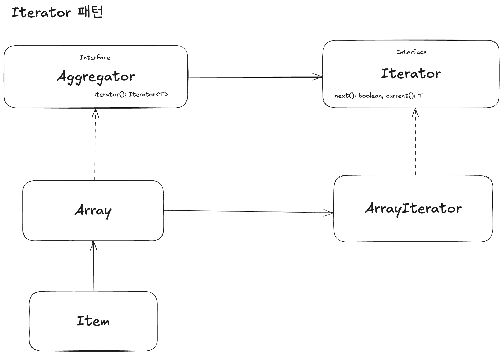

# Iterator

컬렉션의 내부 구조를 노출하지 않고도, 모든 요소에 순차적으로 접근할 수 있게 해주는 패턴이다.

- 컬렉션의 내부 구현을 숨길 수 있다.
- 순회 로직을 분리하여 단일 책임 원칙을 지킬 수 있다.
- 여러 종류의 순회 방식을 쉽게 구현할 수 있다.
- 메모리의 효율적인 처리가 가능하다.

## Aggregator

**순회 가능한 객체**를 의미한다.
여러 요소들을 모아둔 컬렉션을 추상화한 인터페이스이다.
